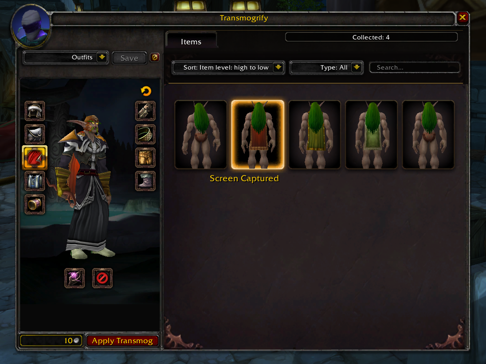

# mod-transmog-plus

Slot-based transmogrification module for [AzerothCore](https://github.com/azerothcore/azerothcore-wotlk).
Appearances are stored per slot (not per item), so your look stays when you swap gear.

## Features

- Slot-based transmog -- appearances stay on the equipment slot when you swap gear.
- Account-wide collection -- any appearance unlocked by one character is available account-wide.
- Configurable appearance collection on equip, acquisition, or both.
- Optional account-wide collection of otherwise valid armor and weapon appearances, even when the acquiring character cannot personally use them.
- Configurable acquisition binding requirements.
- Option to hide individual armor slots (helm, shoulders, chest, etc.).

## Collection Unlock Modes

Appearance collection and appearance usage are separate systems. Collection settings determine
whether an appearance is learned for the account. The existing transmog restrictions still
determine whether a character may apply that appearance.

The main collection setting is:

```ini
Transmog.CollectionUnlockMode = 0
```

Available modes:

- `0 = EQUIPPED_ONLY` -- original module behavior. An eligible appearance is learned when the item is equipped.
- `1 = ACQUIRED_ONLY` -- an eligible appearance is learned when the item enters the player's inventory. Acquisition binding rules apply.
- `2 = ACQUIRED_AND_EQUIPPED` -- checks items on acquisition and again on equip. Equip acts as a fallback for items that were not collectible before becoming bound.

The safest default is `0`, which preserves the original equip-only behavior.

Additional collection options:

```ini
Transmog.CollectionBindingRequirement = 0
Transmog.CollectionEligibility = 0
```

`Transmog.CollectionBindingRequirement` applies to acquisition-time collection in modes `1` and `2`:

- `0 = ANY` -- collect any otherwise eligible acquired item.
- `1 = BIND_ON_PICKUP_ONLY` -- collect acquired items only when their template is Bind on Pickup.
- `2 = PERMANENTLY_BOUND` -- collect acquired items that are already soulbound or whose template is Bind on Pickup.

`Transmog.CollectionEligibility` controls who may collect an appearance:

- `0 = CHARACTER_USABLE` -- the current character must satisfy the normal class, race, proficiency, quality, and item-category rules.
- `1 = ACCOUNT_COLLECTIBLE` -- collect otherwise valid armor and weapon appearances for the account even when the current character cannot personally use them. Normal restrictions still apply when applying the appearance.

Example presets:

```ini
# Original behavior
Transmog.CollectionUnlockMode = 0
Transmog.CollectionBindingRequirement = 0
Transmog.CollectionEligibility = 0

# Retail-inspired account collection
Transmog.CollectionUnlockMode = 2
Transmog.CollectionBindingRequirement = 2
Transmog.CollectionEligibility = 1
```

Older installations using `Transmog.CollectionUnlockSource` and
`Transmog.CollectionUnlockOnEquip` remain supported temporarily. When the new
`Transmog.CollectionUnlockMode` setting is absent, the module translates the old values and
prints a warning asking the administrator to update the configuration. When the new setting is
present, it is authoritative and the deprecated settings do not override it.

See `conf/mod_transmog_plus.conf.dist` for full descriptions and presets.

## Optional Addon (WIP)

This module includes a WoW 3.3.5a client addon in the `addon/` directory. It provides a
visual transmog interface with 3D item preview, sorting, filtering, search, pagination, and a
session-only layout test mode. If the addon is not installed, the standard gossip menu is used
as a fallback.



Test mode can be toggled with:

```text
/transmog testmode
```

Test mode fills the appearance grid with client-side preview entries without changing account,
character, collection, or server data. It resets after logout, client restart, or `/reload`.

Known addon issues:
- Icon glow border for pending transmog slots not working.

## Installation

1. Place the module under the `modules/` folder of your AzerothCore source directory.
2. Re-run CMake and build.
3. Copy `conf/mod_transmog_plus.conf.dist` to `mod_transmog_plus.conf` and adjust as needed.
4. Import the SQL files manually, or let AzerothCore auto-import them on next server start.
5. Spawn the Transmog NPC in-game: `.npc add 190012`

Addon installation (optional): copy the `addon/Transmog/` folder to your client's
`Interface/AddOns/` directory.

## Configuration

All prices, quality restrictions, type rules, collection rules, and requirement ignores are
configurable in `mod_transmog_plus.conf`. See the distributed config file for details.

### Live configuration reload

After rebuilding once with live-reload support, runtime transmog settings can be changed without
restarting worldserver. Edit the active `mod_transmog_plus.conf`, then run:

```text
.reload config
```

The reload updates:

- Module enablement and transmog price.
- Allowed and denied item-entry lists.
- Collection unlock mode, binding requirement, and eligibility.
- Allowed item qualities.
- Armor, off-hand, weapon-type, handedness, tier, and fishing-pole rules.
- Race, class, skill, spell, event, and stat requirement-ignore settings.

New values apply to subsequent acquisitions, equips, and transmog actions. Reloading the config does
not delete or rebuild collected appearances, applied slot records, or database data.

## Known Limitations

- **Hidden appearance**: When a slot is hidden, its character-sheet icon turns invisible
  instead of showing a special icon. This happens because a fake item entry number is used
  to represent the hidden state, which is necessary for proper equipment refresh.
- **Set bonus counter**: Transmogging an item that belongs to an equipment set causes the
  client to show an incorrect set count (e.g. 5/6 instead of 6/6). The set bonus still
  functions correctly -- this is a display-only issue in the character sheet.

## Credits

- [flekz-games](https://github.com/flekz-games) for [cmangos-transmog](https://github.com/flekz-games/cmangos-transmog)
- [malinmr](https://github.com/malinmr) for porting the addon to AzerothCore
- [Stefan2102](https://github.com/Stefan2102) for the original `mod-transmog-plus` module

## License

GNU Affero General Public License v3 -- see `LICENSE`.

